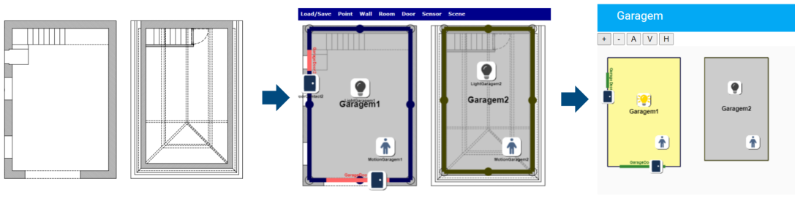
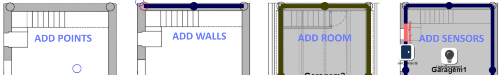

# HOME-PLAN
Home Plan lovelace component for Home Assistant

You can design your home plan and lay sensors and devices on it. It provides a visual representation of your home. It also enables you to trigger sensors(e.g. light) and scenes.




## Install

### HACS users

Follow the HACS instructions when installing it.

### Manually 

Copy the content of the dist folder to www/community/home-plan/ in your Home Assistant configuration directory. Create these folders if they do not exist.

Add the resources to configuration.yaml or in the settings

```yaml
lovelace:
  mode: yaml
  resources:
    [ 
      { url: /local/community/home-plan/home-plan.js, type: module }
    ]
```

## Configure

Configuration is achieved by performing three actions:
- Design the home plan - outside HA
- Link devices with the plan objects
- Associate scenarios (if any)

### Design the plan

1. Copy the folder "site" to your machine.
2. Open the index.html file with your favorite browser
3. Load an image with your home plan.
4. Create points, walls connecting points, rooms composed of walls
5. Add Doors
6. Add Sensors
7. Add Scene buttons to the plan
8. Copy the configuration and paste it in HomeAssistant



### Link devices

To associate devices you have two options:

- Assign a device to a named sensor

```yaml
entities:
  - id: light.shelly_shsw_1_8caab5614b49
    sensor: LuzEscritorio1
```

- Assign a device to a named location

```yaml
entities:
  - id: light.shelly_shsw_1_8caab5614b49
    location: Escritorio1
```

### Scenarios
You can assign scenarios to scene buttons:

```yaml
entities:
  - scene: scene.persiana
    sceneButton: Quarto1up
```

### Other options

*zoom* - defines zoom level.

0 for automatic or enter multiplier:

```yaml
zoom: 1
```

### Example full configuration

```yaml
type: custom:home-plan
entities:
  - id: light.shelly_shsw_1_8caab5614b49
    sensor: LightGaragem1
  - id: light.shelly_shsw_1_8caab5614b49
    location: Garagem1
  - id: binary_sensor.0x158d0004abdb28_motion
    sensor: MotionGaragem1
  - id: binary_sensor.0x158d0004abdb28_motion
    location: Garagem1
  - id: binary_sensor.0x158d0005887cdf_contact
    sensor: DoorGaragem1
  - id: binary_sensor.0x158d00047f811b_motion
    sensor: MotionGaragem2
  - id: binary_sensor.0x158d00047f811b_motion
    location: Garagem2
zoom: 0
plan: {"pointlist":[{"x":30,"y":20,"l":"1"},{"x":270,"y":20,"l":"1"},{"x":270,"y":380,"l":"1"},{"x":30,"y":380,"l":"1"},{"x":350,"y":20,"l":"2"},{"x":560,"y":20,"l":"2"},{"x":350,"y":360,"l":"2"},{"x":560,"y":360,"l":"2"}],"lineList":[{"from":0,"to":1,"lvl":"1"},{"from":0,"to":3,"lvl":"1"},{"from":3,"to":2,"lvl":"1"},{"from":2,"to":1,"lvl":"1"},{"from":4,"to":5,"lvl":"2"},{"from":5,"to":7,"lvl":"2"},{"from":7,"to":6,"lvl":"2"},{"from":4,"to":6,"lvl":"2"}],"roomList":[{"room":"Garagem2","walls":[-7,4,5,6],"xc":455,"yc":190,"points":[{"x":350,"y":360},{"x":350,"y":20},{"x":560,"y":20},{"x":560,"y":360},{"x":350,"y":360}],"presence":false},{"room":"Garagem1","walls":[0,-3,-2,-1],"xc":150,"yc":200,"points":[{"x":270,"y":20},{"x":270,"y":380},{"x":30,"y":380},{"x":30,"y":20},{"x":270,"y":20}],"presence":false}],"doorList":[{"name":"GarageDoor1","type":"Exterior","size":"300","wall":2,"lvl":"1","points":{"x":70,"y":380,"x1":220,"y1":380},"blinder":false,"open":false},{"name":"GarageDoor2","type":"Exterior","size":"100","wall":1,"lvl":"1","points":{"x":30,"y":70,"x1":30,"y1":120},"blinder":false,"open":false}],"sensorList":[{"type":"Light","x":150,"y":160,"name":"LightGaragem1"},{"type":"Light","x":450,"y":120,"name":"LightGaragem2"},{"type":"Motion","x":210,"y":300,"name":"MotionGaragem1"},{"type":"Motion","x":510,"y":300,"name":"MotionGaragem2"},{"type":"Door","x":190,"y":380,"name":"DoorContact1"},{"type":"Door","x":30,"y":150,"name":"DoorContact2"}],"sceneList":[],"image":"garage.png"}
```
